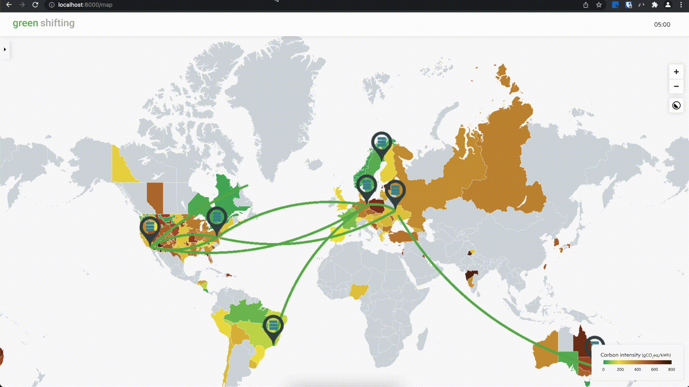

# green shifting

## Inspiration
Servers need a tremendous amount of energy, most of it coming from fossil fuels. Wouldn't it be nice if as much as possible of the consumed energy was purely renewable? We want to make computations greener!
 
## What it does
Our platform simulates multiple data centres and their workloads placed across the globe. Each data centre has a current workload and its associated power consumption as well as the onsite produced green energy resources. By querying the current weather forecasts (solar and wind efficiencies) for each location, it predicts the available green energy resources for every data centre and shifts the current workloads such as virtual machines to other data centres that currently have an overproduction of green energy. Thereby, the self-consumption of green energy is optimized.

## How we built it

### Data Warehousing
The weather forecasts for solar and wind efficiencies were queried from [Open Weather](https://openweathermap.org/).  The location of the data centres as well as their workload and green energy production data are being processed to compute the optimal shifting operations. The data centres can be specified through the visualization dashboard. This logic was programmed in a Python Backend.

### Simulation Engine
The simulation algorithm predicts the necessary shifts of workloads to optimize the green energy consumption. Both the algorithm and the whole necessary data science component are implemented in the Python Backend.

### Visualization Dashboard
The dashboad allows the user to add customized data centres, visualize the workload shifts across the globe throughout the day and provide additional metadata e.g. the current carbon intensity for the various locations per kWh and the portion of renewabled energy currently being produced in a certain country. This is implemented as a React Frontend. The base worldmap including the additional metadata for certain countries is inspired by the project [electricityMap](https://github.com/electricitymap/electricitymap-contrib).

### Connection
The Python Backend and the React Frontend are connected through a web socket for continuously streamed shifting updates. To start our platform, a single docker-compose command is sufficient.

## Challenges we ran into
* API Request Limits
* wind direction arrows
* interconnecting system components
* managing different work packages
* API specifications

## Accomplishments that we're proud of
* large improvement of green energy consumption through shifting algorithm as the workload gets distributed to locations with remaining green energy resources
  * green energy consumption without shifting: 0,18%
  * green energy consumption with shifting: 0,58%
* shifting algorithm
* animated shifting arrows
* real-time simulation

## What we learned
* smart algorithms can make a major contribution to global sustainability 
* there is only one power grid in Europe
* green energy production is highly weather dependent

## What's next for Green Shifting
Let's see if we have convinced VMware ;)
